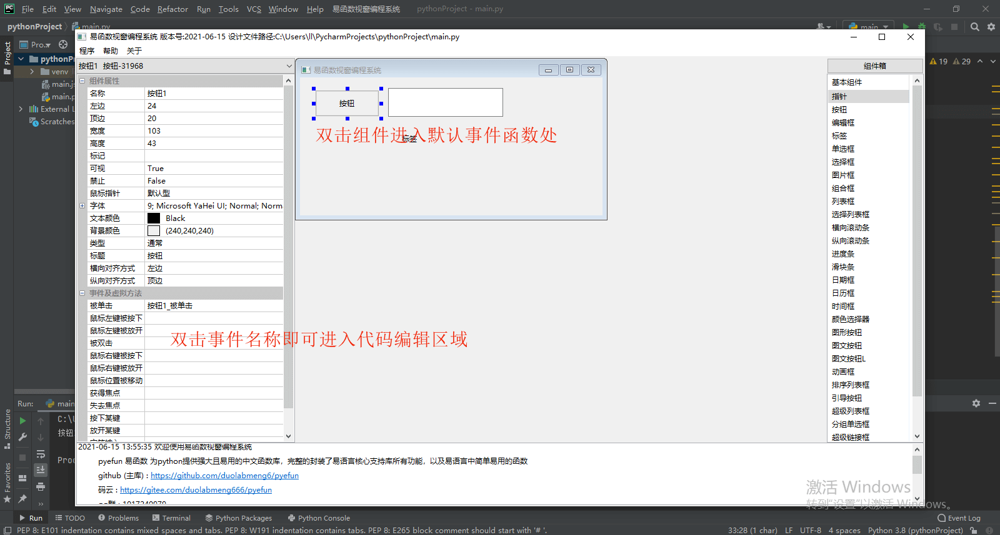
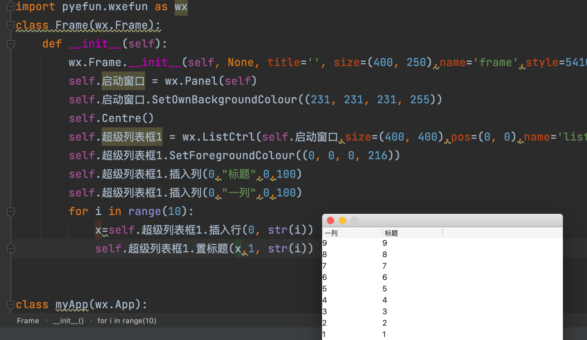
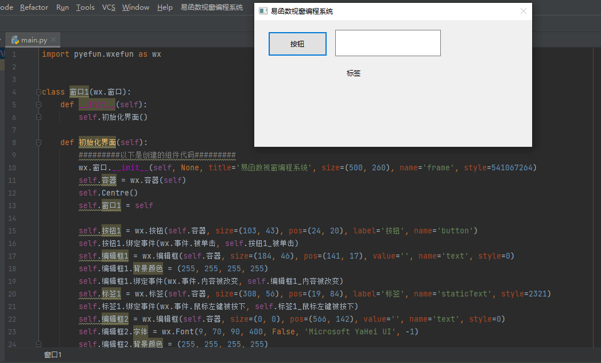

# pyefun 易函数 (精易pyefun函数库)

[](https://github.com/duolabmeng6/pyefun)
[](https://gitee.com/duolabmeng666/pyefun/stargazers)
[](https://pyefun.readthedocs.io/zh_CN/latest/?badge=latest)


为python提供强大且易用的中文函数库，完整的封装了易语言核心支持库所有功能，以及易语言中简单易用的函数

# 易函数的愿景

* 愿世界上没有难用的编程语言
* 易函数是为了抹平不同编程语言之间的差异使中国人，可以快速上手软件开发
* 易函数不是翻译各个编程语言的类库，而是将最实用的功能通过中文直观地展示出来，使其符合中国人的思维逻辑
* 易函数并不局限于编程语言，所有的编程语言都可以编写易函数并使用易函数
* 易函数已经开发 go语言( [goefun](https://github.com/duolabmeng6/goefun) ) python语言( [pyefun](https://github.com/duolabmeng6/pyefun) ) 未来主流的编程语言都能拥有易函数如（ java，c#，c++，php，js）
* 愿更多的国人参与到efun（易函数）的开发中，让世界没有难用的编程语言
* 易函数，以开源，开放，合作，共赢的姿态，迎接中文编程开发者的反哺，易函数的使用者，最终会变成易函数的开发者，持续贡献优秀的代码，形成良好的循环
* 易函数，将打造为是一款模块化、高性能、企业级的python基础开发框架
 
# 易函数的特性

- 完全兼容 `window` `macOS` `linux` `ubuntu` `centos` 运行
- 完全兼容 python 运行环境 支持 docker 部署
- 全中文函数名和注释 以（易语言核心支持库，火山类库，精易模块）的命名风格极大地降低了使用门槛
- 超300+的实用函数，涵盖所有技术领域应用（深度学习，图像处理，文字处理，自动化测试）
- 全部命令经过测试用例测试 100% 放心使用
- 所有命令均有测试用例可以查看后立即使用
- 超丰富的文本处理函数 正则表达式 简单易用快速上手
- 线程池 协程池 简单易用，大大地降低使用线程，协程的技术门槛
- 全网最好用的编码转换功能 自动检测编码 自动转换到对应编码
- 易函数为 [wxpython](https://www.wxpython.org/) 插上中文函数的翅膀，支持跨平台可视化窗口软件开发，以易语言的组件库命名开发，降低使用门槛
- 易函数界面库，支持跨平台 `window`  `mac OS`  `ubuntu` 可视化窗口程序开发，实现一套代码多端运行。
- 超方便的excel操作函数，极大地降低了大数据处理的难度

# 文档

https://pyefun.readthedocs.io/zh_CN/latest/?badge=latest

# 安装

正式版本(稳定) 定期更新

正式版本 https://pypi.org/project/pyefun/

```
pip install pyefun
```


测试版本 实时更新 如有bug请及时反馈

测试版本 https://test.pypi.org/project/pyefun/

```
pip install -i https://test.pypi.org/simple/ pyefun
```


# 使用

```python
from pyefun import *
```


# wxefun 跨平台窗口程序开发

* wxefun 为 wxPython 插上中文函数的翅膀  `import wx`  可替代为 `import pyefun.wxefun as wx` 即可提供中文函数支持对原有项目没有任何影响
* 以易语言核心支持库组件库为标准封装的界面库。
* 具有易语言开发界面特色。
* 令人熟悉的易语言组件属性和组件事件命名。
* 支持跨平台 `window` ，`mac OS`， `ubuntu` 可视化窗口程序开发，实现一套代码多端运行。

使用
```python
import pyefun.wxefun as wx
```

```python
# 完全可替代wx模块加载中文函数的同时对原有项目不会受到任何影响
import pyefun.wxefun as wx

按钮1 = wx.按钮(启动窗口, size=(100, 48), pos=(0, 0), label='按钮', name='button')
按钮1.绑定事件(wx.事件.按钮被点击, 按钮_按钮被单击)

编辑框1 = wx.编辑框(启动窗口, size=(100, 48), pos=(100, 48), value='', name='text', style=0)
编辑框1.绑定事件(wx.事件.内容被改变, 编辑框_内容被改变)

编辑框1.内容 = "祖国你好"
编辑框1.高度 = 100
编辑框1.宽度 = 100
编辑框1.左边 = 100
编辑框1.顶边 = 100
编辑框1.可视 = False
编辑框1.禁止 = True
编辑框1.鼠标指针 = wx.鼠标指针.手型
编辑框1.边框 = wx.边框.细边框
```

# 易函数视窗编程系统

<video id="video" controls="" preload="none" poster="">
<source id="mp4" src="https://user-images.githubusercontent.com/59047063/122020732-9e37b800-cdf7-11eb-940b-7427b9dd496d.mp4" type="video/mp4">
</video>

易函数视窗编程系统由 `易函数视窗设计器` 和 pycharm插件`易函数视窗编程系统` 以及`wxefun`易函数ui库组成

易函数视窗编程系统是一款为中国人入门编程的产品

易函数视窗编程系统安装及使用教程 https://pyefun.readthedocs.io/zh_CN/latest/wxefun.html

可视化界面设计器



## mac运行情况


## win运行情况



# 安装ide代码提示插件

https://github.com/tuchg/ChinesePinyin-CodeCompletionHelper


# 欢迎加入易函数，参与贡献：提意见、Issue与文档

易函数是开源的、免费的软件，这意味着任何人都可以为其开发和进步贡献力量。易函数的项目源代码目前同时托管在 github（主库）和 gitee（国内）平台上，两个平台的仓库保持即时的同步，代码贡献统一使用github主库。我们非常欢迎有更多的朋友加入到易函数的开发中来，你为易函数所做出的任何贡献都将会被记录到易函数的史册中。

贡献代码请提交到github主库 码云仓库仅作为镜像

github (主库) : https://github.com/duolabmeng6/pyefun

码云 : https://gitee.com/duolabmeng666/pyefun

qq群 : 1017240979

# 参与开源

## 参与贡献

易函数代码：参与易函数功能开发、单元测试、ISSUE提交、反馈建议等等，https://github.com/duolabmeng6/pyefun

开发文档：参与WIKI文档的撰写，便于更多的人了解、热爱并加入易函数的开发。

## 贡献流程

首先fork一份仓库代码到自己的版本库中；

在自己的版本库中新建开发分支并对代码做修改，随后提交修改到自己的版本库；

在自己的版本库中创建一个pull request，源分支选择自己的开发分支，目标分支选择主库的master分支：https://help.github.com/en/articles/creating-a-pull-request

提交pull request请求，随后等待由项目的开发作者对提交内容做审核，审核通过之后你将成为易函数的成员之一；

恭喜你，你的名字将永久地载入到易函数源代码的贡献列表中；

## 协作约定

1. 函数名**必须**使用直观易用的**中文命名**。请参考易语言的支持库命名，精易模块、火山开发平台的中文函数命名方式
2. 注释**必须**包括**使用方法**，**代码示例**，**注意事项** ，如果逻辑复杂的程序部分需要阐述实现思路
3. **必须**编写**测试用例**。如此运行单个用例：`$ python -m unittest pyefun.regexpUtil_test`
4. 请保持 Windows、Linux 的兼容性。如果是 Windows 的专有函数不要引入公共库 `pyefun/__init__.py` 中，可参考`pyefun/asyncPoolGevent`、`pyefun/javscript` 的方法封装，使用时单独引入即可
5. 贡献代码时 **务必** 检查代码是否运行正常。
   
请通过github贡献代码。或者通过提交 issues 的方式贡献代码亦可，贡献代码方式多种多样。


# 项目推荐

* goefun (go易函数) 为golang提供强大且易用的中文函数库，易语言go函数库，完整的封装了易语言核心支持库所有功能，以及易语言中简单易用的函数 https://github.com/duolabmeng6/goefun

* ide中文拼音插件 https://github.com/tuchg/ChinesePinyin-CodeCompletionHelper

# 学习交流

[精易论坛](https://bbs.125.la/forum.php?mod=viewthread&tid=14681745)
