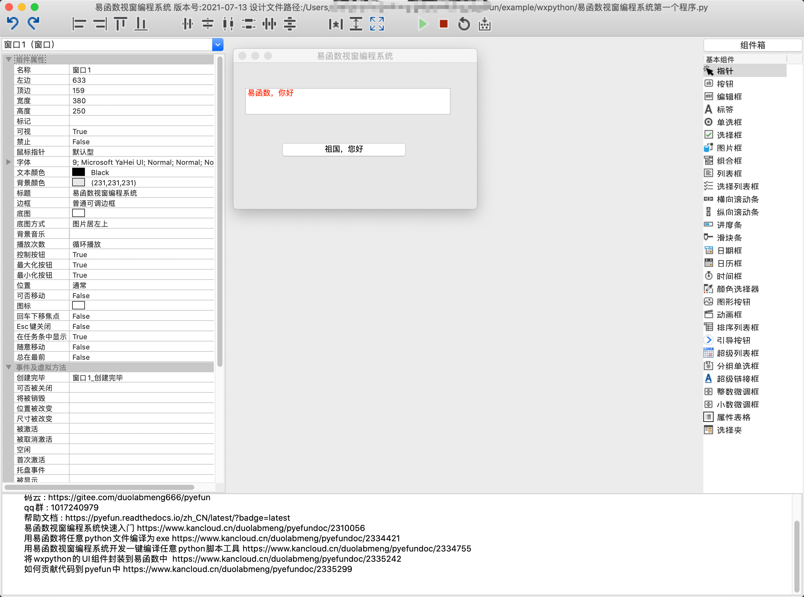
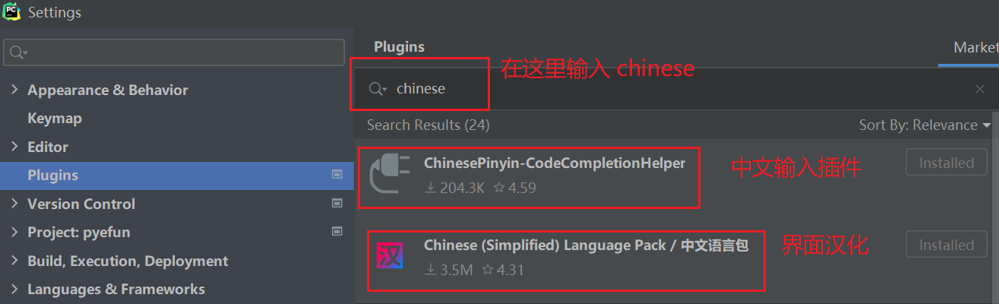

# pyefun 易函数 (精易pyefun函数库)

[](https://github.com/duolabmeng6/pyefun)
[](https://gitee.com/duolabmeng666/pyefun/stargazers)
[](https://pyefun.readthedocs.io/zh_CN/latest/?badge=latest)
[](https://github.com/duolabmeng6/pyefun/actions/workflows/python-publish.yml)
[](https://github.com/duolabmeng6/pyefun/actions/workflows/python-app.yml)
[](https://pypi.org/project/pyefun/)

为python提供强大且易用的中文函数库，完整的封装了易语言核心支持库所有功能，以及易语言中简单易用的函数

# 易函数的愿景

* 愿世界上没有难用的编程语言
* 易函数是为了抹平不同编程语言之间的差异使中国人，可以快速上手软件开发
* 易函数不是翻译各个编程语言的类库，而是将最实用的功能通过中文直观地展示出来，使其符合中国人的思维逻辑
* 易函数并不局限于编程语言，所有的编程语言都可以编写易函数并使用易函数
* 易函数已经开发 go语言( [goefun](https://github.com/duolabmeng6/goefun) ) python语言( [pyefun](https://github.com/duolabmeng6/pyefun) ) 未来主流的编程语言都能拥有易函数如（ java，c#，c++，php，js）
* 愿更多的国人参与到efun（易函数）的开发中，让世界没有难用的编程语言
* 易函数，以开源，开放，合作，共赢的姿态，迎接中文编程开发者的反哺，易函数的使用者，最终会变成易函数的开发者，持续贡献优秀的代码，形成良好的循环
* 易函数，将打造为是一款模块化、高性能、企业级的python基础开发框架

# 易函数的特性

- 易函数完全兼容所有 python 运行环境 `window` `macOS` `linux` `ubuntu` `centos` ，支持 docker 部署
- 全中文函数名和注释 以（易语言核心支持库，火山类库，精易模块）命名风格极大地降低了使用门槛
- 超 `1000+` 中文实用函数，涵盖所有技术领域应用（深度学习，图像处理，文字处理，自动化测试），全面简化 python 开发和学习的门槛
- 易函数中所有命令通过均经过测试用例 100% 放心使用，测试用例也作为使用例程，查看后立即上手使用
- 超丰富的文本处理函数，正则表达式，简单易用快速上手
- 简单易用的线程池，协程池，大大地降低使用的技术门槛
- 最好用的编码转换功能，自动检测编码，自动转换到对应编码
- 超方便的excel操作函数，极大地降低了大数据处理的难度
- 易函数提供一键编译功能将任意python代码，转换为 c 编译的可执行程序
- 易函数界面库为 [wxPython](https://www.wxpython.org/) 插上中文函数的翅膀，以易语言组件库命名开发，降低使用门槛
- `易函数视窗编程系统` 配备完整的视窗软件开发生态集成 `开发` `编译` `可视化界面设计` 轻松拖拽组件设计界面，一键编译发布。 支持跨平台可视化窗口程序开发，`window`  `mac OS`  `ubuntu` ，实现一套代码多端运行。

# 文档

* [pyefun 易函数 API文档 ](https://pyefun.readthedocs.io/zh_CN/latest/?badge=latest)
* [易函数视窗编程系统快速入门文字版](https://www.kancloud.cn/duolabmeng/pyefundoc/2310056)
* [易函数视窗编程系统快速入门视频教程](https://www.bilibili.com/video/BV1rV411W7KN/)
* [易函数使用示例代码](https://github.com/duolabmeng6/pyefun/tree/master/example)
* [用易函数将任意python文件编译为exe](https://www.kancloud.cn/duolabmeng/pyefundoc/2334421)
* [用易函数视窗编程系统开发一键编译任意python脚本工具](https://www.kancloud.cn/duolabmeng/pyefundoc/2334755)
* [将wxpython的ui组件封装到易函数教程](https://www.kancloud.cn/duolabmeng/pyefundoc/2335242)
* [如何贡献代码到pyefun中教程](https://www.kancloud.cn/duolabmeng/pyefundoc/2335299)


# 安装

正式版本(稳定) 定期更新

正式版本 https://pypi.org/project/pyefun/

```
pip install pyefun
```


测试版本 实时更新 如有bug请及时反馈

测试版本 https://test.pypi.org/project/pyefun/

```
pip install -i https://test.pypi.org/simple/ pyefun
```

# 使用

```python
from pyefun import *
```
[易函数使用示例代码](https://github.com/duolabmeng6/pyefun/tree/master/example)

> 提示: 如果你的程序是需要编译为exe的必须使用`import pyefun as efun` 而不能是`import *` 
> [Nuitka python工具使用教程](https://zhuanlan.zhihu.com/p/133303836)

# 易函数视窗编程系统

易函数视窗编程系统是一款为中国人入门 python 编程的产品

配备完整的视窗软件开发生态集成 `开发` `编译` `可视化界面设计` 轻松拖拽组件设计界面，一键编译发布。

支持跨平台可视化窗口程序开发，`window`  `mac OS`  `ubuntu` ，实现一套代码多端运行。


易函数视窗编程系统由三个主要部分组成

* pycharm 插件 `易函数视窗编程系统`
* 易函数视窗可视化设计器
* 易函数 ui 组件库 [wxPython](https://www.wxpython.org/)

[易函数视窗编程系统快速入门文字版](https://www.kancloud.cn/duolabmeng/pyefundoc/2310056)

[易函数视窗编程系统快速入门视频讲解](https://www.bilibili.com/video/BV1rV411W7KN/)


## 优势

* **会中文就看得懂**，中文编程，得天独厚，简单，易用。
* **最强开发工具** `Pycharm` 中文软件界面，拼音输入，智能提示。
* **界面设计器**，易函数视窗可视化设计器，轻松拖拽组件，设计界面，所见即所得。
* **中文函数库**， `pyefun` 全中文函数库，专门为 [wxPython](https://www.wxpython.org/) 封装的中文组件，以易语言核心支持库组件库为标准封装的界面库，组件的方法，属性，事件，都是令人熟悉的命名。
* **组件中文命名** 易于理解和使用
* **一键编译**，可执行程序， 支持跨平台编译`window` `macOS` `linux`，易函数提供一键编译功能将任意python代码，转换为 c 编译的可执行程序。


代码示例

```python
# 完全可替代原有英文wx模块，加载中文函数的同时对原有项目，不会受到任何影响
import pyefun.wxefun as wx


class 窗口1(wx.窗口):
    def __init__(self):
        self.初始化界面()

    def 初始化界面(self):
        #########以下是创建的组件代码#########
        wx.窗口.__init__(self, None, title='易函数视窗编程系统', size=(380, 250), name='frame', style=wx.窗口边框.普通可调边框)
        self.容器 = wx.容器(self)
        self.Centre()
        self.窗口1 = self

        self.绑定事件(wx.事件.创建完毕, self.窗口1_创建完毕)
        self.编辑框1 = wx.编辑框(self.容器, size=(321, 42), pos=(18, 39), value='易函数，你好', style=wx.TE_CENTRE)
        self.编辑框1.字体 = wx.Font(12, 74, 90, 400, False, '微软雅黑', 28)
        self.编辑框1.文本颜色 = (255, 0, 0, 255)
        self.按钮1 = wx.按钮(self.容器, size=(193, 40), pos=(76, 116), label='祖国，您好')
        self.按钮1.字体 = wx.Font(12, 74, 90, 400, False, '微软雅黑', 28)
        self.按钮1.绑定事件(wx.事件.被单击, self.按钮1_被单击)

        #########以上是创建的组件代码##########

    #########以下是组件绑定的事件代码#########

    def 按钮1_被单击(self, event):
        print("按钮1_被单击")
        self.编辑框1.内容 = "祖国，您好！"
        wx.信息框("祖国，您好！", "温馨提示")

    def 窗口1_创建完毕(self, event):
        print("窗口1_创建完毕")

    #########以上是组件绑定的事件代码#########


class 应用(wx.App):
    def OnInit(self):
        self.窗口1 = 窗口1()
        self.窗口1.Show(True)
        return True


if __name__ == '__main__':
    app = 应用()
    app.MainLoop()

    #########以上是组件绑定的事件代码#########

class 应用(wx.App):
    def OnInit(self):
        self.窗口1 = 窗口1()
        self.窗口1.Show(True)
        return True

if __name__ == '__main__':
    app = 应用()
    app.MainLoop()

```


## 易函数视窗设计器
window 版本

mac 版本


## mac运行情况


## win运行情况


# 安装ide代码提示插件

pycharm 在插件中搜索 chinese 安装两个插件，界面中文汉化语言包和 [拼音提示插件](https://github.com/tuchg/ChinesePinyin-CodeCompletionHelper)





# 欢迎加入易函数，参与贡献：提意见、Issue与文档

易函数是开源的、免费的软件，这意味着任何人都可以为其开发和进步贡献力量。易函数的项目源代码目前同时托管在 github（主库）和 gitee（国内）平台上，两个平台的仓库保持即时的同步，代码贡献统一使用github主库。我们非常欢迎有更多的朋友加入到易函数的开发中来，你为易函数所做出的任何贡献都将会被记录到易函数的史册中。

贡献代码请提交到github主库 码云仓库仅作为镜像

github (主库) : https://github.com/duolabmeng6/pyefun

码云 : https://gitee.com/duolabmeng666/pyefun

qq群 : 1017240979

# 参与开源

## 视频讲解如何贡献代码

[将 wxpython 的UI组件封装到易函数中](https://www.bilibili.com/video/BV18V411W79X)

[如何贡献代码到 pyefun 中 文字教程](https://www.kancloud.cn/duolabmeng/pyefundoc/2335299)


## 参与贡献

易函数代码：参与易函数功能开发、单元测试、ISSUE提交、反馈建议等等，https://github.com/duolabmeng6/pyefun

开发文档：参与WIKI文档的撰写，便于更多的人了解、热爱并加入易函数的开发。

## 贡献流程

首先fork一份仓库代码到自己的版本库中；

在自己的版本库中新建开发分支并对代码做修改，随后提交修改到自己的版本库；

在自己的版本库中创建一个pull request，源分支选择自己的开发分支，目标分支选择主库的master分支：https://help.github.com/en/articles/creating-a-pull-request

提交pull request请求，随后等待由项目的开发作者对提交内容做审核，审核通过之后你将成为易函数的成员之一；

恭喜你，你的名字将永久地载入到易函数源代码的贡献列表中；

## 协作约定

1. 函数名**必须**使用直观易用的**中文命名**。请参考易语言的支持库命名，精易模块、火山开发平台的中文函数命名方式
2. 注释**必须**包括**使用方法**，**代码示例**，**注意事项** ，如果逻辑复杂的程序部分需要阐述实现思路
3. **必须**编写**测试用例**。如此运行单个用例：`$ python -m unittest pyefun.regexpUtil_test`
4. 请保持 Windows、Linux 的兼容性。如果是 Windows 的专有函数不要引入公共库 `pyefun/__init__.py` 中，可参考`pyefun/asyncPoolGevent`、`pyefun/javscript` 的方法封装，使用时单独引入即可
5. 贡献代码时 **务必** 检查代码是否运行正常。
   

请通过github贡献代码。或者通过提交 issues 的方式贡献代码亦可，贡献代码方式多种多样。


# 项目推荐

* [goefun (go易函数) 为golang提供强大且易用的中文函数库，易语言go函数库，完整的封装了易语言核心支持库所有功能，以及易语言中简单易用的函数](https://github.com/duolabmeng6/goefun)

* [ide中文拼音提示插件](https://github.com/tuchg/ChinesePinyin-CodeCompletionHelper)

# 学习交流

[精易论坛](https://bbs.125.la/forum.php?mod=viewthread&tid=14681745)
