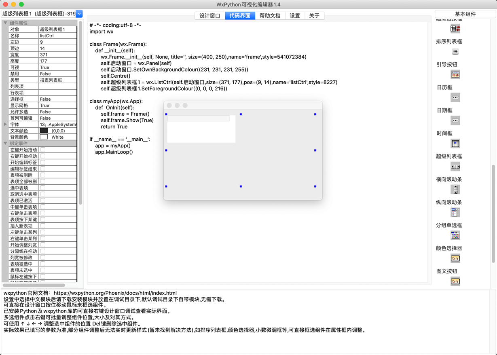
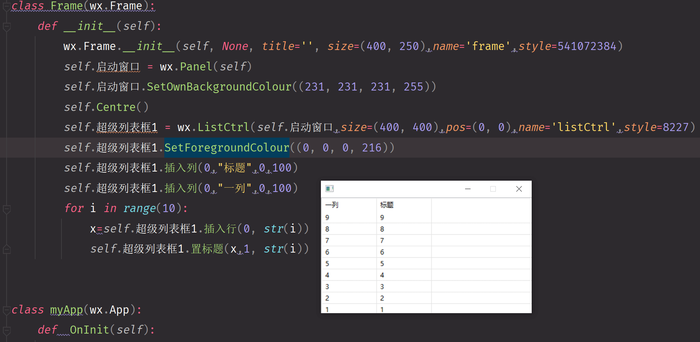

# wxefun 跨平台窗口程序开发

* wxefun 为 wxPython 插上中文函数的翅膀  `import wx` 可替代为`import pyefun.wxefun as wx` 即可提供中文函数支持对原有项目没有任何影响
* 以易语言核心支持库组件库为标准封装的界面库。
* 具有易语言开发界面开发的特色。
* 令人熟悉的易语言组件属性和组件事件命名。
* 支持跨平台 window ，mac os， ubuntu 可视化窗口程序开发，实现一套代码多端运行。

使用
```python
import pyefun.wxefun as wx
```

```python
# 完全可替代wx模块加载中文函数的同时对原有项目不会受到任何影响
import pyefun.wxefun as wx

按钮1 = wx.按钮(启动窗口, size=(100, 48), pos=(0, 0), label='按钮', name='button')
按钮1.绑定事件(wx.事件_按钮_被点击, 按钮3_按钮被单击)

编辑框1 = wx.编辑框(启动窗口, size=(100, 48), pos=(100, 48), value='', name='text', style=0)
编辑框1.绑定事件(wx.事件_内容被改变, 编辑框1_内容被改变)

编辑框1.内容 = "祖国你好"
编辑框1.高度 = 100
编辑框1.宽度 = 100
编辑框1.左边 = 100
编辑框1.顶边 = 100
编辑框1.可视 = False
编辑框1.禁止 = True
编辑框1.鼠标指针 = 5

```
可视化界面设计器

mac运行情况

win运行情况

