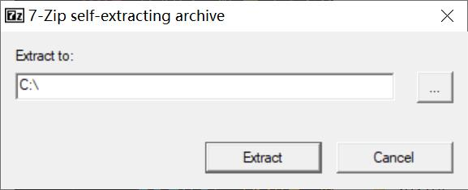
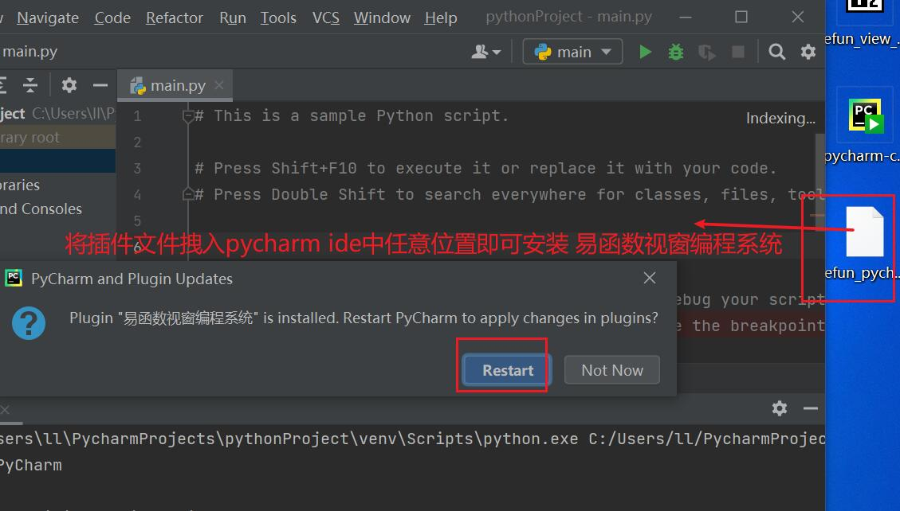
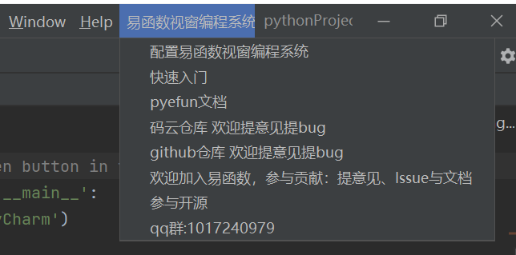
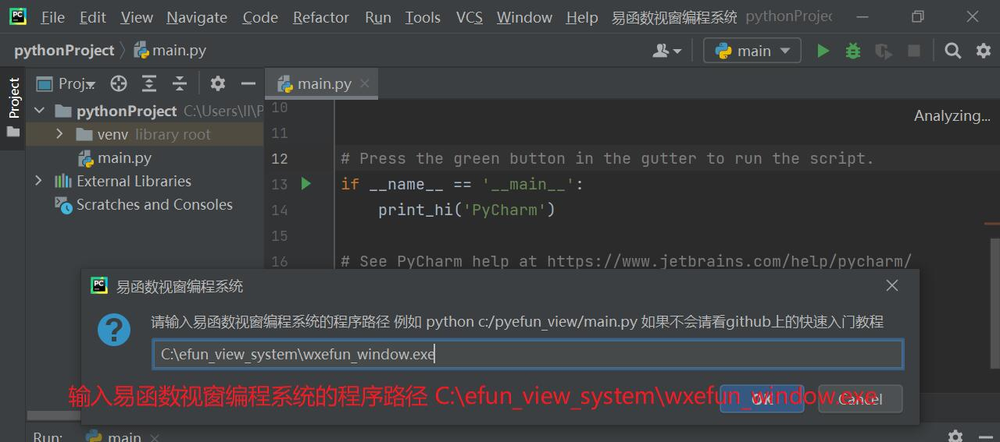
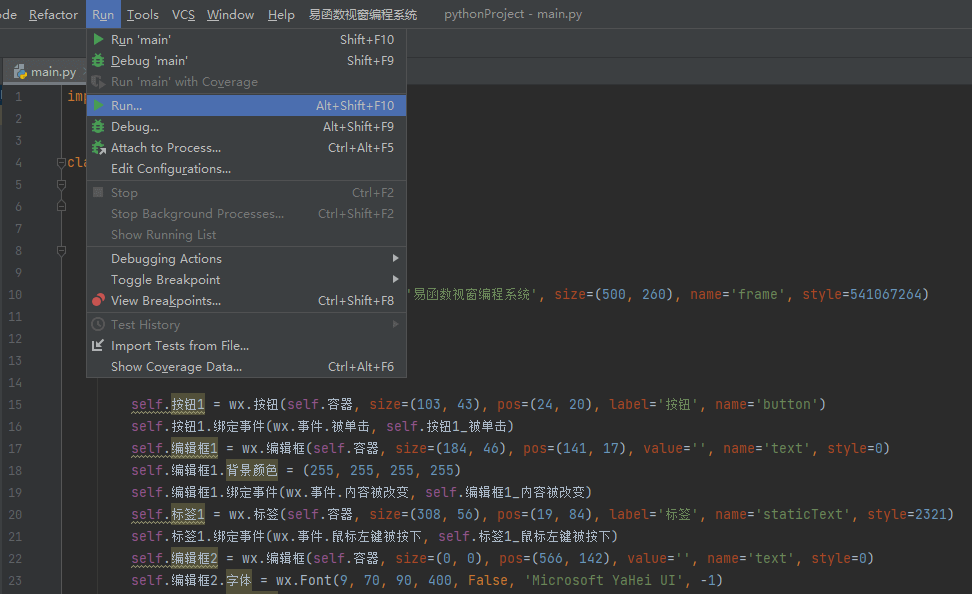

# 易函数视窗编程系统

易函数视窗编程系统是一款为中国人入门编程的产品

易函数视窗编程系统由 `易函数视窗设计器` 和 pycharm插件`易函数视窗编程系统` 以及`wxefun`易函数ui库组成


代码风格展示

```python
import pyefun.wxefun as wx


class 窗口1(wx.窗口):
    def __init__(self):
        self.初始化界面()

    def 初始化界面(self):
        #########以下是创建的组件代码#########
        wx.窗口.__init__(self, None, title='易函数视窗编程系统', size=(380, 250), name='frame', style=541072896)
        self.容器 = wx.容器(self)
        self.Centre()
        self.窗口1 = self

        self.按钮1 = wx.按钮(self.容器, size=(106, 42), pos=(28, 25), label='易函数您好', name='button')
        self.按钮1.鼠标指针 = wx.鼠标指针.手型
        self.按钮1.绑定事件(wx.事件.被单击, self.按钮1_被单击)
        self.编辑框1 = wx.编辑框(self.容器, size=(182, 42), pos=(153, 25), value='', name='text', style=0)
        self.编辑框1.背景颜色 = (255, 255, 255, 255)
        self.按钮2 = wx.按钮(self.容器, size=(301, 39), pos=(31, 90), label='禁止状态的按钮', name='button')
        self.按钮2.禁止 = True
        self.按钮2.字体 = wx.Font(16, 74, 90, 400, False, 'Microsoft YaHei UI', 28)
        self.按钮2.文本颜色 = (255, 0, 0, 255)
        self.按钮2.绑定事件(wx.事件.被单击, self.按钮2_被单击)
    #########以上是创建的组件代码##########

    #########以下是组件绑定的事件代码#########

    def 按钮1_被单击(self, event):
        print("按钮1_被单击")
        self.编辑框1.内容 = "祖国您好"


    def 按钮2_被单击(self,event):
        print("按钮2_被单击")

    #########以上是组件绑定的事件代码#########


class 应用(wx.App):
    def OnInit(self):
        self.窗口1 = 窗口1()
        self.窗口1.Show(True)
        return True


if __name__ == '__main__':
    app = 应用()
    app.MainLoop()

```

[视频教程 github 易函数视窗编程系统安装及使用教程](https://github.com/duolabmeng6/pyefun/discussions/37)

[视频教程 bilibili 易函数视窗编程系统安装及使用教程](https://www.bilibili.com/video/BV1yV41147Qr/)


## 下载易函数视窗编程系统

[百度网盘 https://pan.baidu.com/s/1Nccbrh23070PBCs7eAl4fA](https://pan.baidu.com/s/1Nccbrh23070PBCs7eAl4fA)
提取码: p4qb

* efun_view_system.exe 易函数视窗编程系统安装包
* efun_pycharm.jar 易函数视窗编程系统Pycharm插件安装包

## 1.运行 易函数视窗编程系统安装包 `efun_view_system.exe`

将文件解压至 `c:/`



## 2.安装 易函数视窗编程系统 Pycharm 插件安装包 `efun_pycharm.jar` 

将 efun_pycharm.jar 文件拽入 Pycharm 编辑器中 任意位置

出现安装提示 以后点击 restart 重启编辑器 出现易函数视窗编程系统菜单 就算是安装成功了



## 3. 配置 易函数视窗编程系统

点击pycharm顶部菜单 `易函数视窗编程系统` 选择 `配置易函数视窗编程系统`

输入以下路径
```text
C:\efun_view_system\wxefun_window.exe
```

点击确定配置完成 




## 4. 从 Pycharm 中打开易函数视窗设计器

任意新建 python 文件后 在编辑器中 右键点击菜单 `打开易函数视窗设计器`

设计好界面后双击组件即可进入代码编辑区域


## 5. 运行 查看效果

运行代码需要安装 `pyefun` 和 `wxpython`

```sh
pip install pyefun
pip install wxpython
```

菜单栏中点击 `Run` 再选择 `Run` 选择 当前文件即可运行

该代码支持跨平台可在 `window` `mac os` `ubuntu` 中运行




## 6. 打包为exe

> 提示: 如果你的程序是需要打包编译为exe的必须使用`import pyefun as efun` 而不能是`import *`
> 打包使用 [Nuitka python打包工具使用教程](https://zhuanlan.zhihu.com/p/133303836)

### 下载文件

查看教程安装相关打包的文件 https://zhuanlan.zhihu.com/p/133303836


```shell

nuitka --standalone --mingw64 --show-memory --show-progress --nofollow-imports --follow-import-to=need --output-dir=o 需要打包的文件.py

```

执行运行后需要一步一步将依赖复制出来然后放入目录中调试 调试完成后 

改命令同上面的命名会隐藏黑色的控制台窗口

```shell
nuitka --standalone --windows-disable-console --mingw64 --nofollow-imports --show-memory --show-progress --follow-import-to=need --output-dir=o 需要打包的文件.py
```